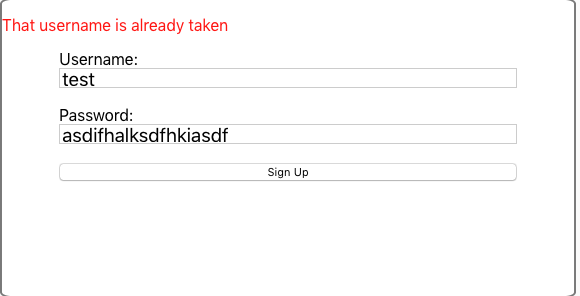
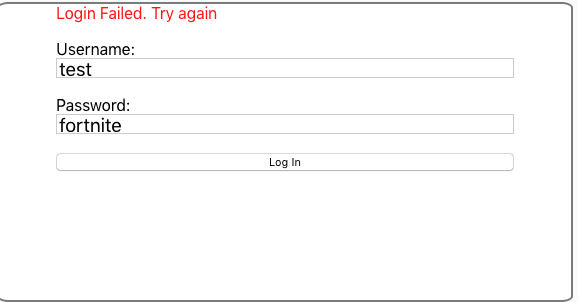
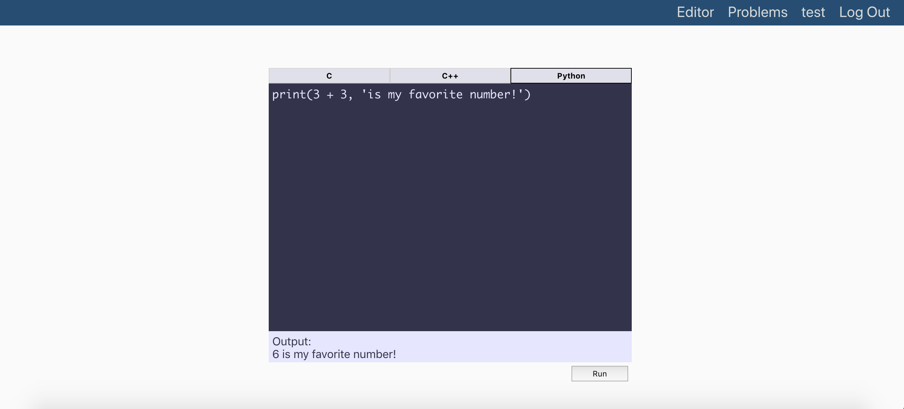
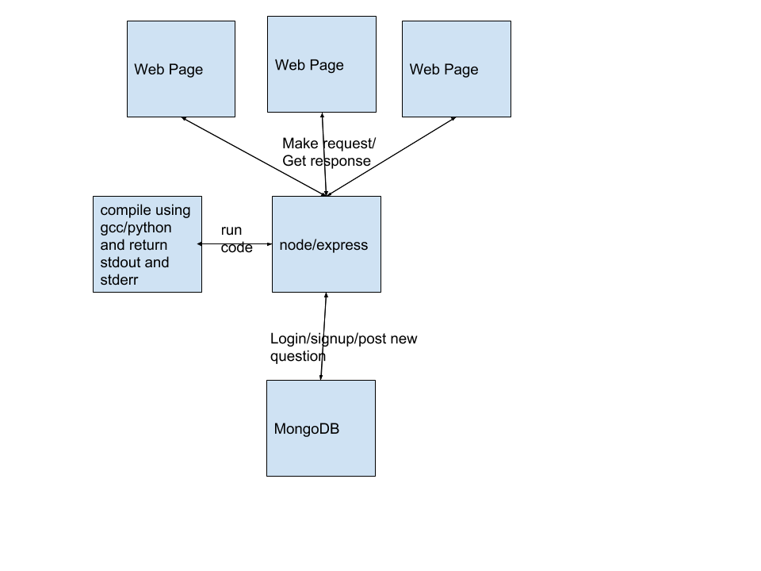

# User stories
Ayush loves to code. However, as a social person, he finds coding by himself to be very lonely. Ayush wants to be able to interact/socialize with his friends while writing code. He would like to be able to work collaboratively in one notepad on the same piece of code as his friend to solve coding challenges together. He would also like to be able to compete in coding games against his friend where he can earn points or race his friend.

# Pre-Sprint 1
* Set up user login/signup feature.
* Ability to post new questions to board of questions.
* Ability to write code in a text field and compile the code in C, C++, Python and view stdout.

Handles failed signup due to username being taken  

Handles failed login due to wrong password  

Editor Screen  

# Sprint 1
* ~~Handle compilation errors and return the relevant error message to user~~ Format compilation errors more readably
* Create and implement framework for friend system. Once we get this done we can begin working on creating 'rooms' aka websocket connections between users who are friends
* Create websocket connection between users so that document can be modified in real time between users

# Todo list for the future... maybe in sprint 2
* Add approval functionality to user submitted problems so that admin has to approve it
* Improve the user submitted code i.e. require test cases, detailed description, skeleton, etc.
* Improve logout feature to automatically log out after X time or when the window/browser is closed
* Check user code vs. test cases for specific coding problem

# Architecture

# Technologies
MERN Stack
* MongoDB
* Express.js
* React.js
* Node.js

Websockets for real time communication between users

Chose to use this stack because it is easy to use and learn and we can take advantage of lots of libraries. Express makes handling requests really easy. 

# Team Members
Quinn Meurer and Ayush Upneja
